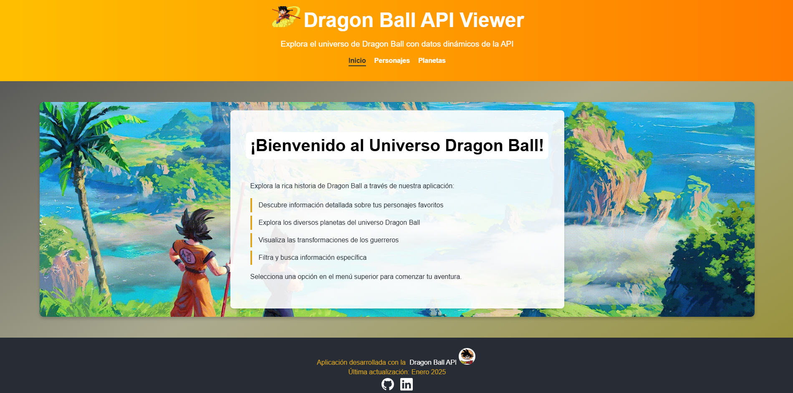
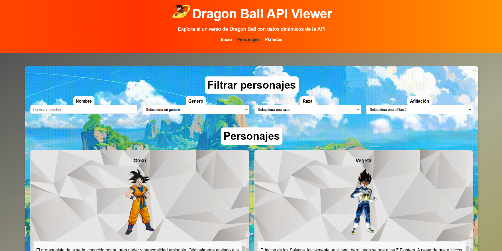
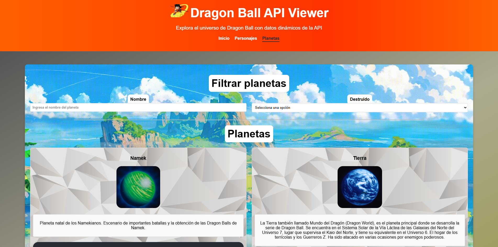

# 🐉 Dragon Ball API Project Documentation

## 📖 Table of Contents
- [API Selection](#api-selection)
- [API Understanding](#api-understanding)
- [API Request Structure](#api-request-structure)
- [Project Implementation](#project-implementation)
- [Troubleshooting](#troubleshooting)
- [Improvements](#improvements)
- [Deployment](#deployment)
- [Screenshots](#screenshots)

## 🎯 API Selection

**Selected API:** Dragon Ball API  
**Base URL:** [https://web.dragonball-api.com/](https://web.dragonball-api.com/)

## 🔍 API Understanding

### Data Types
The Dragon Ball API provides comprehensive data about characters from various Dragon Ball sagas, including:
- Character Names
- Gender
- Race
- Detailed Descriptions

### Authentication
🔑 **API Key Required?** No - The API is completely free and open for use

## 📡 API Request Structure

### Base Configuration
- **HTTP Method:** GET
- **Base URL:** [https://dragonball-api.com/api/](https://dragonball-api.com/api/)

### Available Endpoints
- `/characters` - Retrieve all Dragon Ball characters
- `/planets` - Retrieve all Dragon Ball planets

### Sample Request
```http
GET https://dragonball-api.com/api/characters?race=Saiyan&affiliation=Z%20fighter
```

## 💻 Project Implementation

### Project Overview
This application allows users to explore detailed information about characters from the Dragon Ball universe. It leverages the Dragon Ball API to fetch and display up-to-date character data in an interactive interface.

### API Documentation
For comprehensive API documentation, visit:
[https://web.dragonball-api.com/documentation](https://web.dragonball-api.com/documentation)

## 🔧 Troubleshooting

### Issue #1: Incomplete Character Data
**Problem:** Batch character requests return less detailed data compared to individual character requests.  
**Solution:** Implemented individual character lookups using IDs from the batch request to obtain complete character data.

### Issue #2: Missing/Corrupted Images
**Problem:** Some character images were missing or incorrectly loaded.  
**Solution:** Created a local image repository within the project's `img` folder for affected character transformations.

## ⭐ Improvements
- Implemented AbortControllers to prevent unwanted fetch accumulation
- Enhanced request handling and search functionality
- Improved styling and UI components
- Complete script restructuring
- Updated footer and header contents

## 🚀 Deployment

### Live Demo
Visit the live application at: [https://luiscoding05.github.io/](https://luiscoding05.github.io/)

### Installation

1. Clone the repository:
```bash
git clone https://github.com/LuisCoding05/LuisCoding05.github.io
```

2. Launch the application:
   - Open with Live Server in your IDE, or
   - Open the index.html file directly

## 📸 Screenshots

### Home Page


### Characters View


### Planets View
